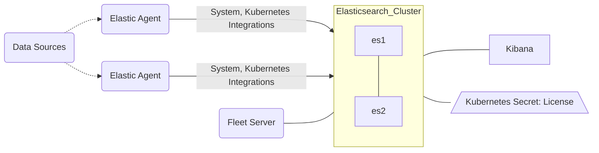

# Quickstart

## Base Diagram

## Deployable Assets in this Directory

| Elastic Cluster | Filename | Resource (Kind) | Count |  Features Added |
| :-------------: |:-------------:| :-------------: | :-------------: | :-------------: |
|main|elasticsearch.yml|Elasticsearch|2|[Virtual Memory](https://www.elastic.co/guide/en/cloud-on-k8s/current/k8s-virtual-memory.html), [Internal Monitoring](https://www.elastic.co/guide/en/cloud-on-k8s/current/k8s-stack-monitoring.html), [Ephemeral Drives](https://www.elastic.co/guide/en/cloud-on-k8s/current/k8s-volume-claim-templates.html#k8s_emptydir)|
|main|kibana.yml|Kibana|1||
|main|fleet.yml|Fleet Server(Agent)|1|[Fleet](https://www.elastic.co/guide/en/cloud-on-k8s/current/k8s-elastic-agent-fleet.html), [APM Integration](https://www.elastic.co/guide/en/apm/guide/current/upgrade-to-apm-integration.html) |
|main|fleet.yml|[Agents](https://www.elastic.co/guide/en/cloud-on-k8s/current/k8s-elastic-agent-fleet-configuration-examples.html)|1+n|[System](https://docs.elastic.co/en/integrations/system), [Kubernetes](https://docs.elastic.co/integrations/kubernetes)|
|main|rbac.yml|[RBAC Roles](https://kubernetes.io/docs/reference/access-authn-authz/rbac/)||Kubernetes RBAC for Agents, Fleet|
|ECK-Wide|trial-license.yml|Secret:[License](https://www.elastic.co/guide/en/cloud-on-k8s/current/k8s-licensing.html)||trial-license.yml|[Trial License](https://www.elastic.co/guide/en/cloud-on-k8s/current/k8s-licensing.html#k8s-start-trial)|

## Quickstart Cluster with Ephemeral Storage

This is a basic quickstart ECK cluster that has no persistent storage.  It is meant for drop-in demos or fast exploration with deletion shortly thereafter.

Fleet and a DaemonSet of Agents are offered as a setup as well.  Each has several integrations you'd want for Kubernetes observability and Kibana is preconfigured to load these Fleet policies. Lastly there is a trial license secret and instrucitons for deploying `kube-state-metrics` for certain metricsets.

These are just flat yamls that you can deploy at will and as long as the application permits it, leave off anything you dont want. For example:

`kubectl apply -f elasticsearch.yml -f kibana.yml -f fleet.yml -f trial-license.yml`

## Viewing your Data in Kibana

You can use the built-in `elastic` user and the password is stored in a default secret. The command below should pull this value for you. 

`kubectl get secret elasticsearch-es-elastic-user -o=jsonpath='{.data.elastic}' | base64 --decode; echo`

You can then access the running Kibana by running a kubectl port-forward command like below or naturally, working to expose the cluster some other way.

`kubectl port-forward service/kibana-kb-http 5601`

## Adding Kube-State-Metrics

To add the kube-state-metrics server (a Kubernetes official resource) for the `state_*` metricsets, you can visit the repo or deploy the standard example directory resources after cloning the repo locally.

eg:
1. `git clone https://github.com/kubernetes/kube-state-metrics.git`
2. `kubectl apply -f kube-state-metrics/examples/standard/`

## Next Steps?

- Want to see the API specs for each CRD? -> [CRD API Reference](https://www.elastic.co/guide/en/cloud-on-k8s/current/k8s-api-reference.html)
- Want to add Elasticsearch cluster settings? -> [Node Configurations](https://www.elastic.co/guide/en/cloud-on-k8s/current/k8s-node-configuration.html)
- Want to specify out the cluster resources for a larger cluster?
	+ [Manage Compute Resources](https://www.elastic.co/guide/en/cloud-on-k8s/current/k8s-managing-compute-resources.html)
	+ [Virtual Memory Settings](https://www.elastic.co/guide/en/cloud-on-k8s/current/k8s-virtual-memory.html)
- Want to expose the cluster via other Services? -> [Kubernetes Services](https://www.elastic.co/guide/en/cloud-on-k8s/current/k8s-services.html)
- Use Your/Custom Certificates -> [Custom Certs](https://www.elastic.co/guide/en/cloud-on-k8s/current/k8s-custom-http-certificate.html)
- Want to setup persistent storage
	+ [Volume Claim Templates](https://www.elastic.co/guide/en/cloud-on-k8s/current/k8s-volume-claim-templates.html)
	+ Bonus Reading: [Storage Recommendations](https://www.elastic.co/guide/en/cloud-on-k8s/current/k8s-storage-recommendations.html) 
- Want to setup Elastic cluster snapshots? -> [Create Automated Snapshots](https://www.elastic.co/guide/en/cloud-on-k8s/current/k8s-snapshots.html)
- Want to setup a cluster with multiple node types? -> [NodeSets Overview](https://www.elastic.co/guide/en/cloud-on-k8s/current/k8s-orchestration.html)
- Want to setup a more complex cluster topology? -> [Advanced Node Scheduling](https://www.elastic.co/guide/en/cloud-on-k8s/current/k8s-advanced-node-scheduling.html)
- Want to fix/upgrade the license -> [Manage licenses in ECK](https://www.elastic.co/guide/en/cloud-on-k8s/current/k8s-licensing.html)
- Check out our recipe seciton in the docs -> [Recipes for ECK](https://www.elastic.co/guide/en/cloud-on-k8s/current/k8s-recipes.html)

