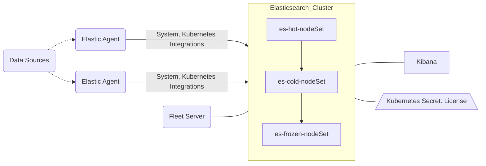

# Tiered (Time Series) Example

## Base Diagram w/ optional Fleet Implementation



## Deployable Assets in this Directory

| Elastic Cluster | Filename | Resource | Count |  Features Added |
| :-------------: |:-------------:| :-------------: | :-------------: | :-------------: |
|main|elasticsearch.yml|Elasticsearch|3|[Virtual Memory](https://www.elastic.co/guide/en/cloud-on-k8s/current/k8s-virtual-memory.html), [Persistent Storage](https://www.elastic.co/guide/en/cloud-on-k8s/current/k8s-volume-claim-templates.html), [Compute Resources](https://www.elastic.co/guide/en/cloud-on-k8s/current/k8s-managing-compute-resources.html), [Custom Configuration Files (Synonyms)](https://www.elastic.co/guide/en/cloud-on-k8s/current/k8s-bundles-plugins.html), [Elastic Audit Settings](https://www.elastic.co/guide/en/cloud-on-k8s/current/k8s_audit_logging.html), [Internal Monitoring](https://www.elastic.co/guide/en/cloud-on-k8s/current/k8s-stack-monitoring.html), [Multiple nodeSets](https://www.elastic.co/guide/en/cloud-on-k8s/current/k8s-orchestration.html#k8s-nodesets)|
|main|kibana.yml|Kibana|1|[Kibana APM Self Monitoring](https://www.elastic.co/guide/en/kibana/current/kibana-debugging.html), [Compute Resources](https://www.elastic.co/guide/en/cloud-on-k8s/current/k8s-kibana-advanced-configuration.html)|
|main|rbac.yml|[RBAC Roles](https://kubernetes.io/docs/reference/access-authn-authz/rbac/)||Kubernetes RBAC for Agents, Fleet|
|ECK-Wide|trial-license.yml|Secret:[License](https://www.elastic.co/guide/en/cloud-on-k8s/current/k8s-licensing.html)||Trial License to Enable All Features|
|main|fleet.yml|Fleet Server(Agent)|1|[Fleet](https://www.elastic.co/guide/en/cloud-on-k8s/current/k8s-elastic-agent-fleet.html), [APM Integration](https://www.elastic.co/guide/en/apm/guide/current/upgrade-to-apm-integration.html) |
|main|fleet.yml|[Agents](https://www.elastic.co/guide/en/cloud-on-k8s/current/k8s-elastic-agent-fleet-configuration-examples.html)|1+n|[System](https://docs.elastic.co/en/integrations/system), [Kubernetes](https://docs.elastic.co/integrations/kubernetes)|

## Tiered Storage Cluster

Like the search cluster, this is taken from the quickstart cluster but focused around showing how a cluster with multiple instance types and persistent storage more suited to time series or observability use cases.  There are now multiple `nodeSet`s for Hot, Cold, and dedicated Frozen nodes, each with its own values and definition.  Fleet was not included but see below for a couple simple steps to uncomment the components back into the cluster.

## Kustomize Instrucitons

`kubectl kustomize` or `kubectl kustomize build` will generate a templated set of YAMLs when run in the right place and in this case, either the `dev` or `prod` sub-directories under `overlay`.

The way it works is that in your terminal, place yourself in one of the the overlay subdirectories, either dev or prod, and run a command similar to the examples below.  Each directory's kustomizaton.yaml file will reference where it pulls the base YAML files from (our base directory) and then changes (patches) to be "overlayed" on top of them; things like compute settings or node counts are typically larger in the production.  The `Base Values` chart below shows some of the differences between each environment. These are generic use case starter values and I would encourage you to iteratively test or engage with Elastic Professional Services etc. to gauge these if you aren't sure.  You can edit any of the values for dev or prod in the `kustomization.yaml` file in each and/or the patches directory and some should have commented values like namespace if you want to add more.  

**Example Commands:**

- Deploy Dev Cluster

While in the `overlay/dev` directory, run `kubectl kustomize | kubectl apply -f -` or `kubectl kustomize build | kubectl apply -f -`

- Deploy Prod Cluster*

While in the `overlay/prod` directory, run `kubectl kustomize | kubectl apply -f -` or `kubectl kustomize build | kubectl apply -f -`

>NOTE: While I look for an easier way to update all the CRD object name references, you will need to manually change the elasticsearch cluster name if you deploy these to the same namespace or change the namespaces. 

## Base Values

| Value | Base | Dev | Prod |
| :-------------: | :-------------: | :-------------: |:-------------: |
|Count|2|2|3|
|Version|8.4.3|8.4.3|8.4.2|
|Elastic Compute Settings|-|CPU:(*request*:2-*limit*:6)<br>Memory:(*request*:8GB-*limit*:16GB)|CPU:(*request*:12-*limit*:15)<br>Memory:(*request*:64-*limit*:64)|
|JVM Options|Auto|8GB Heap|30GB Heap|
|Kibana Compute Settings|-|CPU:.5, Mem:1GB|CPU:2, Mem:4GB|
|Volume Claim Size|10GB|25GB|250GB|
|SnapshotSettings|-|-|-|

## Adding Fleet with Preconfigured Agents

You need to do three things to bolt this functionality one. 
1) Uncomment the `fleet.yml` line in the base directory `kustomization.yaml` file.
2) Uncomment the Fleet configuration in the `kibana.yml` base file.
3) Uncomment the Fleet settings in each overlay directories' (dev,prod) `kustomization.yaml` file.

That should allow you to spin up Fleet with Agents adjacent to this setup and be a simple three node standard cluster.

## Viewing your Data in Kibana

You can use the built-in `elastic` user and the password is stored in a default secret. The command below should pull this value for you. 

`kubectl get secret elasticsearch-es-elastic-user -o=jsonpath='{.data.elastic}' | base64 --decode; echo`

You can then access the running Kibana by running a kubectl port-forward command like below or naturally, working to expose the cluster some other way.

`kubectl port-forward service/kibana-kb-http 5601`

## IMPORTANT: USING KIBANA APM

If you want the Kibana APM functionality to work, you need to first pull the apm-token secret via a command like the one below and paste it into the value on line 32 in kibana.yml, populating 

`kubectl get secret apm-server-apm-token -o=jsonpath='{.data.secret-token}' | base64 --decode; echo`

Then take that value and put it in the kibana.yml file like below(`here`).

```
  podTemplate:
    spec:
      containers:
      - name: kibana
        env:
          - name: ELASTIC_APM_SECRET_TOKEN
            value: "<here>"     
```

> NOTE: By default in this quickstart, the env var `ELASTIC_APM_ACTIVE` is set to `false`. You need to turn this to true after adding the token above.

### Adding Kube-State-Metrics

To add the kube-state-metrics server (a Kubernetes official resource) for the `state_*` metricsets, you can visit the repo or deploy the standard example directory resources after cloning the repo locally.

eg:
1. `git clone https://github.com/kubernetes/kube-state-metrics.git`
2. `kubectl apply -f kube-state-metrics/examples/standard/`


## What next?

Some final things to round out a cluster might be topics like...


- Want to see the API specs for each CRD? -> [CRD API Reference](https://www.elastic.co/guide/en/cloud-on-k8s/current/k8s-api-reference.html)
- Want to add Elasticsearch cluster settings? -> [Node Configurations](https://www.elastic.co/guide/en/cloud-on-k8s/current/k8s-node-configuration.html)
- Add an Ingress and/or expose your cluster wider -> [Ingress Example](https://github.com/elastic/cloud-on-k8s/tree/main/config/recipes/traefik),[Istio Ingress](https://github.com/elastic/cloud-on-k8s/tree/main/config/recipes/istio-gateway), [ECK Services](https://www.elastic.co/guide/en/cloud-on-k8s/current/k8s-services.html), [ECK Traffic Splitting](https://www.elastic.co/guide/en/cloud-on-k8s/current/k8s-traffic-splitting.html)
- Add a comprehensive DR/SLM strategy -> [ECK Automated Snapshots](https://www.elastic.co/guide/en/cloud-on-k8s/current/k8s-snapshots.html)
- Setup a Certificate Strategy -> [Custom HTTP Layer Certs](https://www.elastic.co/guide/en/cloud-on-k8s/current/k8s-custom-http-certificate.html), [TLS Certs](https://www.elastic.co/guide/en/cloud-on-k8s/current/k8s-tls-certificates.html), [Cert Manager]()
- Customize the image or pod further eg: update strategies or security -> [Update Strategies](https://www.elastic.co/guide/en/cloud-on-k8s/current/k8s-update-strategy.html), [Customize Pod](https://www.elastic.co/guide/en/cloud-on-k8s/current/k8s-customize-pods.html)
- Bind the nodes to specific node groups/pools -> [Node Topology](https://www.elastic.co/guide/en/cloud-on-k8s/current/k8s-advanced-node-scheduling.html)
- Setup SAML Auth (often a copy/paste from your previous elasticsearch.yml) -> [SAML/Auth Config](https://www.elastic.co/guide/en/cloud-on-k8s/current/k8s-saml-authentication.html)
- Use Your/Custom Certificates -> [Custom Certs](https://www.elastic.co/guide/en/cloud-on-k8s/current/k8s-custom-http-certificate.html)
- Want to setup persistent storage
	+ [Volume Claim Templates](https://www.elastic.co/guide/en/cloud-on-k8s/current/k8s-volume-claim-templates.html)
	+ Bonus Reading: [Storage Recommendations](https://www.elastic.co/guide/en/cloud-on-k8s/current/k8s-storage-recommendations.html) 
